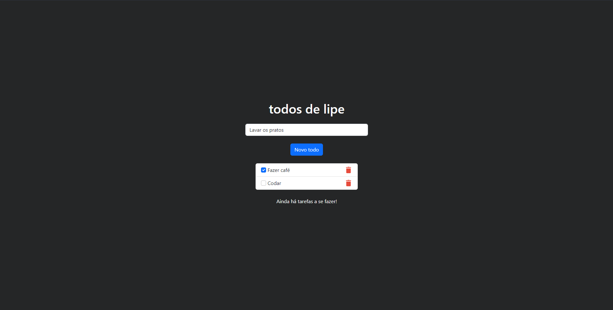
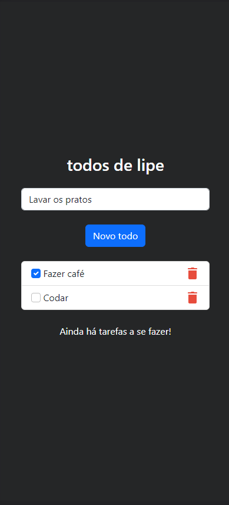
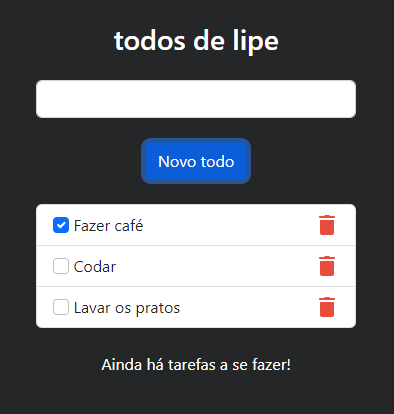
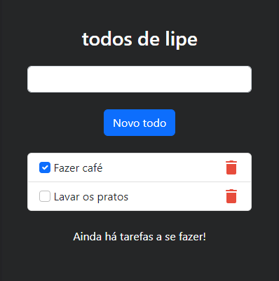
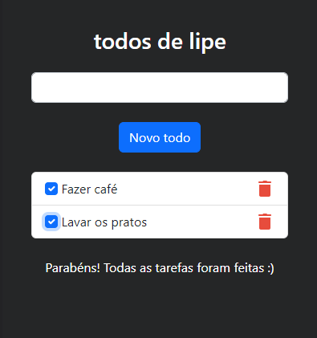

<h1 align="center">VueJS Todo Application</h1>

<h2 align="center">💡 Simple application made with VueJs and Bootstrap that viewing and checking todos, as well as adding and deleting to them</h2>

   
  
  
  

 

## The application

### 🧐 Views

###### Desktop view

###### Mobile view

 

### 🔧 Features

- Adding todos:
  - Every time you click 'Novo todo' or presses enter the site verifies if the input value is not null and adds a new todo to the list:
  

 

- Removing todos:
  - By clicking the trash can icon you can easily delete a mistyped or unwanted todo:
  
  
 

- Marking and seeing todos status:
  - When you mark, unmark, add or delete a todo, a function is called, verifying wether all todos are checked or not and displaying a message according to the context:
  

 

## ⛏️ Made with:
- [VueJs](https://vuejs.org/) - JavaScript Framework for building User Interfaces
- [Bootstrap](https://getbootstrap.com/) - CSS Framework for developing responsive and mobile-first websites

 

## ✍️ Author:
- [@Filipe Silva](https://www.linkedin.com/in/fpeduu/) - Fullstack Developer